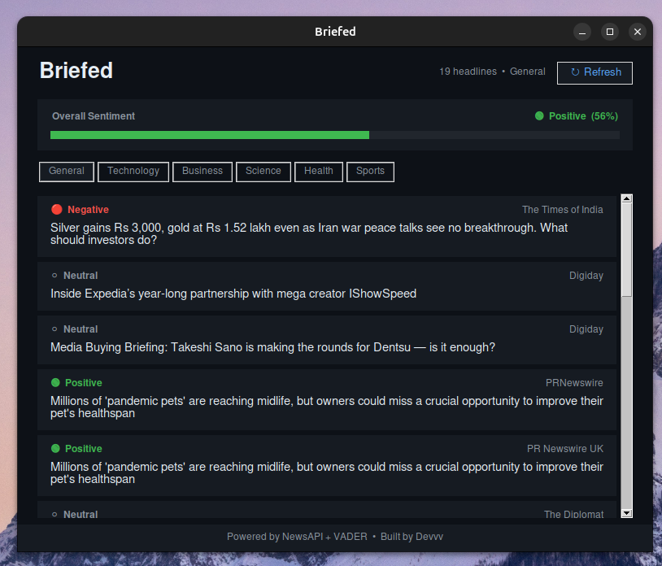

# Briefed 📰

A live news sentiment dashboard built in Python. Briefed fetches the latest headlines and tells you how the world is feeling — positive, negative, or neutral — in real time.

Built with Python, Tkinter, VADER sentiment analysis, and the NewsAPI.

---

## Preview



---

## Features

- 🟢 🔴 ⚪ Color-coded headlines by sentiment
- 📊 Overall sentiment index shown as a live gauge
- 🗂️ Filter by category — General, Technology, Business, Science, Health, Sports
- 🔄 Auto-refreshes every 5 minutes
- 🇮🇳 Focused on Indian news by default
- 🌙 Clean dark UI built with Tkinter

---

## Tech Stack

| Layer     | Library                  |
| --------- | ------------------------ |
| GUI       | Tkinter                  |
| News      | NewsAPI + `requests`     |
| Sentiment | VADER (`vaderSentiment`) |
| Config    | `python-dotenv`          |

---

## Getting Started

### 1. Clone the repo

```bash
git clone https://github.com/DevMytho/briefed.git
cd briefed
```

### 2. Install dependencies

```bash
pip install -r requirements.txt
```

### 3. Get a NewsAPI key

Sign up for a free key at [newsapi.org](https://newsapi.org/). The free tier is enough to run Briefed.

### 4. Set up your environment

Create a `.env` file in the project root:

```
NEWSAPI_KEY=your_key_here
```

> ⚠️ Never push your `.env` file. It's already in `.gitignore`.

### 5. Run the app

```bash
python main.py
```

---

## Project Structure

```
briefed/
│
├── main.py          # Entry point
├── gui.py           # Tkinter UI
├── news.py          # Fetches headlines from NewsAPI
├── sentiment.py     # VADER sentiment analysis
├── config.py        # Settings and constants
│
├── .env             # Your API key (never pushed)
├── .env.example     # Template for contributors
├── .gitignore
├── requirements.txt
└── README.md
```

---

## Configuration

All settings live in `config.py`:

| Setting              | Default  | Description                      |
| -------------------- | -------- | -------------------------------- |
| `MAX_HEADLINES`      | 20       | Number of headlines per category |
| `REFRESH_INTERVAL`   | 300000ms | Auto-refresh interval (5 min)    |
| `POSITIVE_THRESHOLD` | 0.05     | VADER compound score cutoff      |
| `NEGATIVE_THRESHOLD` | -0.05    | VADER compound score cutoff      |

---

## How Sentiment Works

Briefed uses [VADER](https://github.com/cjhutto/vaderSentiment) (Valence Aware Dictionary and sEntiment Reasoner) — a sentiment analysis tool specifically built for short, punchy text like news headlines and social media.

Each headline gets a compound score from **-1.0** (most negative) to **+1.0** (most positive):

```
compound ≥  0.05  →  🟢 Positive
compound ≤ -0.05  →  🔴 Negative
anything between  →  ⚪ Neutral
```

The overall sentiment index is the average compound score across all headlines, normalised to a 0–100% gauge.

---

## License

MIT — do whatever you want with it.
